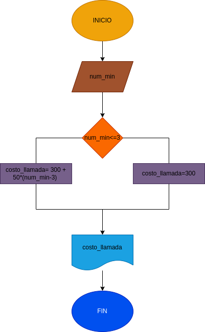

# llamada_telefonica
programa para calcular el costo de una llamada telefonica
ingresar el tiempo de duracion de una llamada telefonica y determinar la cantidad apagrar, deacuerdo con l siguente: 
- Toda llamada que dure 3 minutos o menos  tiene un costo de $300
- Cada minuto adicional cuesta $50 pesos

# Diagrama de flujo

